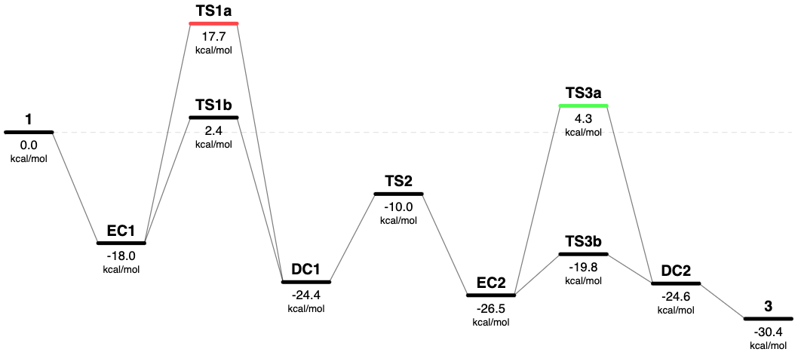

irxnlvl
======

Es un paquete de Python 3 para dibujar diagramas de niveles de energía de reacciones químicas. Está basado en el paquete
[rxnlvl](https://github.com/eutactic/rxnlvl) pero tiene soporte para documentos de [Jupyter](https://jupyter.org) y opciones adicionales para ajustar las unidades de energía.

Pruébalo en Binder
------

Puedes [probar irxnvl en Binder](https://mybinder.org/v2/gh/qcuaeh/irxnlvl.git/HEAD) sin necesidad de instalar nada en tu computadora.

o instálalo localmente
------

Para instalar `irxnlvl` debes tener disponible pip:

    pip install irxnlvl

Crea tu primer diagrama
------

Para crear diagramas requerirás escribir código de Python, pero incluso si nunca has usado Python puedes aprender rápidamente corriendo los ejemplos:

- [Correr el ejemplo 1 en Binder](https://mybinder.org/v2/gh/qcuaeh/irxnlvl.git/HEAD?labpath=example1.ipynb)
- [Correr el ejemplo 2 en Binder](https://mybinder.org/v2/gh/qcuaeh/irxnlvl.git/HEAD?labpath=example2.ipynb)

Entiende los pasos
------

### Primero importa el módulo

    from irxnlvl import *

### y crea un objeto de gráfico vacío

    p = plot(10.0, bgcolour=None, zero=energy(0.0, 'kjmol'), units='kjmol', digits=1)
    
El objeto `plot` requiere los siguientes argumentos:
- `size` - El tamaño vertical del gráfico en cm.
- `bgcolour` - el color de fondo de la imagen, como un entero hexadecimal de 24 bits, o `None`. Si `None`, el fondo será transparente.
- `zero` - un objeto `energy` que representa el cero de las energías relativas. El objeto `energy` tiene dos argumentos: la energía como un número de punto flotante y las unidades, que pueden ser `'kjmol'`, `'eh'` (Hartrees), `'ev'` (electronvoltios), `'kcalmol'` (kilocalorías por mol termoquímicas) o `'wavenumber'`.
- `units` - Las unidades de energía del diagrama, que pueden ser `'kjmol'`, `'eh'` (Hartrees), `'ev'` (electronvoltios), `'kcalmol'` (kilocalorías por mol termoquímicas) o `'wavenumber'`.
- `digits` - Los dígitos después del punto decimal que se usarán para mostrar las energías del diagrama.
- `qualified` - Si es `True`, las unidades en las que cada energía es especificada serán impresas en la imagen. Si es `False`, sólo imprimirá los valores numéricos.

Ahora puedes empezar a agregar elementos al gráfico.

### Agrega una línea base

    p + baseline(colour=0x0, mode='dashed', opacity=0.1)

El objeto `baseline` es una línea que representa el cero de energía y requiere los siguientes argumentos:
- `colour` - un entero hexadecimal de 24 bits representando el color de la arista.
- `mode` - elije entre `'normal'` o `'dashed'`. Controla la apariencia de la arista en términos de la discontinuidad de la línea.
- `opacity` - un flotante entre 0.0 y 1.0 representando la opacidad de la arista.

### Agrega los niveles de energía

    p + level(energy(0, 'kjmol'),  1,  '1',  0x0)

Cada objeto `level` requiere los siguientes argumentos:
- `energy` - un objeto que representa la energía relativa del nivel. El objeto `energy` tiene dos argumentos: la energía como un número de punto flotante y las unidades, que pueden ser `'kjmol'`, `'eh'` (Hartrees), `'ev'` (electronvoltios), `'kcalmol'` (kilocalorías por mol termoquímicas) o `'wavenumber'`.
- `location` - la ubicación ordinal del nivel en el esquema. Éste debe ser un entero positivo diferente de cero. Diferentes niveles pueden compartir la misma ubicación.
- `name` - el nombre del nivel en el esquema. Los niveles no deberían compartir el mismo nombre.
- `colour` - un entero hexadecimal de 24 bits representando el color del nivel.

### Une los niveles de energía

    p + edge(  '1',  'EC1', 0x0, 0.4, 'normal')

Cada objeto `edge` acepta los siguientes argumentos:
- `start` - el `nombre` del nivel del que se origina la arista.
- `end` - el `nombre` del nivel en el que termina la arista. Éste tiene que ser diferente de `start`.
- `colour` - un entero hexadecimal de 24 bits representando el color de la arista.
- `opacity` - un flotante entre 0.0 y 1.0 representando la opacidad de la arista.
- `mode` - elije entre `'normal'` o `'dashed'`. Controla la apariencia de la arista en términos de la discontinuidad de la línea.

### Visualiza el diagrama

    p.render()

### y guárdalo si todo luce bien

    p.write('diagrama.svg')

Creará un archivo de tu gráfica en la misma carpeta donde se abrió el notebook. Puede escribir archivos SVG, PDF y PNG y acepta
las siguientes opciones:
- `scale` - La resolución de la imagen cuando se guarda en formato PNG, por ejemplo scale=2 duplicará el tamaño original de la imagen.
